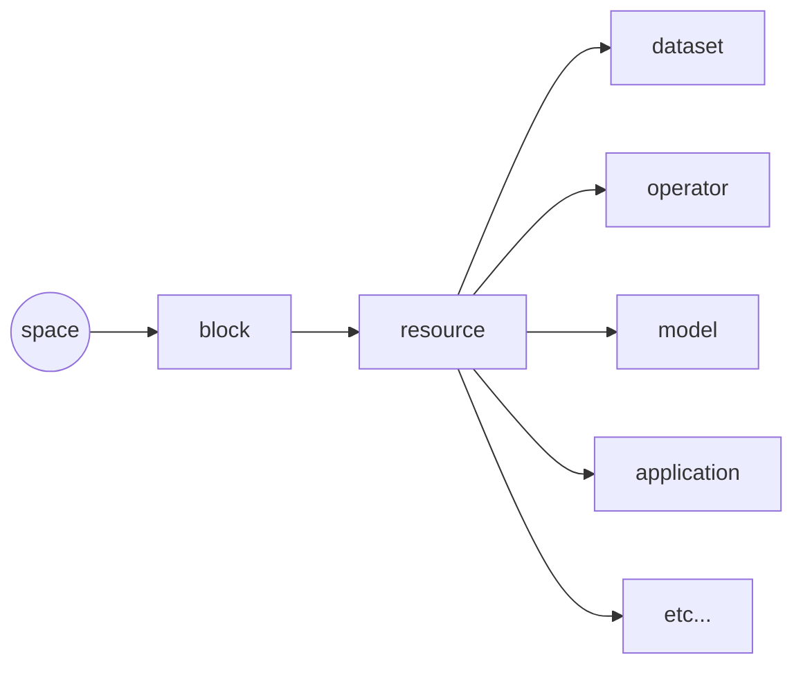

# AADX documentation

This documentation intends to serve as an essential and evolving knowledge base for using the AADX and the underlying infrastructure. Our aim is to expresses concepts and processes in an accessible manner. 

As it has only just begun, the work is far from complete.  Please reach out to us with suggestions on where you feel we should spend time extending the work. [Send email to AADX team.](mailto:aadx@csu.edu.au)

## Contents
1. [Object and data structures](#aadx-semantic-object-hierarchy)
2. [Universal resource identifiers](#universal-resource-identifiers)
3. [Object schemas](#object-schemas)
   - [space schema](#space-schema)
   - [block schema](#block-schema)
   - [dataset schema](#dataset-schema)
4. [Creating resources](#creating-resources)
    - [Using the web application](#using-the-web-application)
    - [General resource creation](#general-resource-creation)
    - [Dataset creation walk-through](#dataset-creation-walk-through)
6. [Sharing resources](#sharing-resources)

## 1. AADX semantic object hierarchy


There is a simple hierarchy of objects within the AADX ( [fig 1.](#fig-1.-basic-object-hierarchy) ). 

### Access and sharing

A **space** acts as the focal point for accessing and cooperatively sharing resources. To achieve this, **space**S can be linked to one or many data-orientated objects  space links are **blocks**.

### Data-orientated objects

A **block** is used to wrap subordinate **resource**S and thereby provide a means of annotating them. There are many subclasses of resource which can be wrapped, such as: **dataset**, **operator**, **model**, and **application**.


### Fig 1. Basic object hierarchy


When adding new information to the system, most of the work involves:
1. choosing the most appropriate **resource** to represent the entity that you are intending to store of within the system. 
2. Fulfilling the schema of the chosen **resource**.

*Please note*: as with any system that aims to capture the metadata related to a given entity, being thorough and precise while providing that information maximises value of the system as a whole. All too often, in such endeavors, optional fields are left empty and mandatory fields are supplied with uninformative, but otherwise compliant values.

## Universal resource identifiers

Objects within the AADX are referenced using [unique/universal resource identifiers (URIs)](https://en.wikipedia.org/wiki/Uniform_Resource_Identifier). 

The underlying semantic layer of the AADX is provided by the Eratos platform, which relabels these as Eratos Resource Names (ERNs). Throughout the AADX, you will find that every object has been assigned a unique ERN and these identifiers are the essential link used to create associations between the various objects -- be that to provide additional context by way of metadata or enabling sharing.

### ERN structure

ERNs are structured strings and composed of a series of concatenated segments that each pertain to specific aspects of the system. For the AADX, only the last two segments `{type}` and `{id}` are of relevance at this time.

```python
# AADX ERN template, where {type} and {id} placeholders.
ern:e-pn.io:{type}:{id}

# the ERN of the schema describing a block.
ern:e-pn.io:schema:block

# an example of a system-generated ERN for a resource
ern:e-pn.io:resource:4728QTVL95QOP5VXZ33LTPU7
```

As can be seen the examples above, the `{id}` segment of some identifiers are human-readable text, while others are randomly generated 24-character strings. 

Randomly generated ids are assigned by the platform when new records are created by regular users. Consequently, users will commonly encounter them when creating and managing their own objects.

The human-readable style require extended permissions to create and are assigned by platform administrators and reserved primarily for core objects, such as schema definitions.

### ERN complete description

*Taken from the Eratos Workspace API (version 1) documentation*

-   `ern`  (Eratos Resource Name)  
    A ERN is a globally unique identifier that identifies a resource within the Eratos ecosystem. It is a structured string that identifies a  `resource`,  `schema`,  `policy`,  `user`,  `account`, or  `node`.  
    _Structure of an`ern`:_
    -   `ern:{node}:{type}:{id}`
        -   `{node}`  - identifies the location or lookup address of a resource. May blank if the resource is not location specific.
        -   `{type}`: - the type of entity this ern represents
            -   `resource`
            -   `node`
            -   `schema`
            -   `policy`
            -   `user`
            -   `account`
        -   `{id}`: - the unique identifier of the  `ern`
            -   Either:
                -   24 character alpha-numeric (e.g.  `XYZABC123456ABCDEF123456`)
                -   A prefixed custom id (common id) in the form  `{namespace}.{customer_id}`
            -   examples:
                -   `ern:e-pn.io:resource:AAAAAAAAAAAAAAAAAAAAAAAA`
                -   `ern:e-pn.io:resource:eratos.block.test`
                -   `ern::node:e-pn.io`
                -   `ern:e-pn.io:schema:space`
                -   `ern::user:AAAAAAAAAAAAAAAAAAAAAAAA`
                -   `ern::account:AAAAAAAAAAAAAAAAAAAAAAAA`

## Object schemas

At the time of writing, there are 86 schema definitions to be found on the AADX, however at an individual level, the majority of these have a very narrow focus.

The three most common are quite possibly those that define **space**, **block**, and **dataset**.

Schema can be discovered by way of the Workspace API endpoints:
```json
// obtain a list of schema on the system.
GET /schemas
// inspect the details of a given schema
GET /schemas/{schemaid}
```

Full definitions of these three schema can be found at the end of this document. We highly encourage users to spend the time to familiarise themselves with these object definitions. Although the **space** schema is simple and **block** is slightly more involved, **dataset** is quite extensive and reflects its versatility.

Do not be put off. In reality, even when being concentious and creating thoroughly described objects, it is unlikely that a user will need to define every optional property within these more complex defintions.
 
### Space schema
```json
 {
    "@id": "ern:e-pn.io:schema:space",
    "@date": "2023-05-10T06:20:52.557345Z",
    "name": "Space",
    "description": "Defines a space for users and resources.\n",
    "deprecated": false,
    "properties": [
      {
        "key": "name",
        "description": "User readable name for the space.\n",
        "type": "string",
        "required": true,
        "textualIndex": true
      },
      {
        "key": "description",
        "description": "User readable description for the space.\n",
        "type": "string",
        "required": true,
        "textualIndex": true
      },
      {
        "key": "group",
        "description": "This parent user group of the space.\n",
        "type": "resource",
        "userEditable": false,
        "resourceTypes": [
          "ern:e-pn.io:schema:group"
        ]
      },
      {
        "key": "collection",
        "description": "This parent resource collection of the space.\n",
        "type": "resource",
        "userEditable": false,
        "resourceTypes": [
          "ern:e-pn.io:schema:collection"
        ]
      },
      {
        "key": "isPersonal",
        "description": "Flag to determine if space is of personal or regular type.\n",
        "type": "boolean",
        "conditionalIndex": true,
        "userEditable": false
      }
    ],
    "_links": {
      "self": "https://api.eratos.com/api/workspace/v1/schemas/ern:e-pn.io:schema:space"
    }
  }
```
### Block schema
```json
{
    "@id": "ern:e-pn.io:schema:block",
    "@date": "2025-07-31T03:43:34.944679Z",
    "name": "Block",
    "description": "An Eratos block that may wrap operators, datasets, and/or resources.\n",
    "deprecated": false,
    "properties": [
      {
        "key": "name",
        "description": "User readable name for the block.\n",
        "type": "string",
        "required": true,
        "textualIndex": true
      },
      {
        "key": "description",
        "description": "User readable description for the block.\n",
        "type": "string",
        "required": true,
        "textualIndex": true
      },
      {
        "key": "shortDescription",
        "description": "A short user readable description for the block.\n",
        "type": "string",
        "required": false,
        "textualIndex": true,
        "maxLength": 92
      },
      {
        "key": "state",
        "description": "The state of the block.\n",
        "type": "string",
        "conditionalIndex": true,
        "userEditable": false,
        "enum": [
          "Draft",
          "Committed",
          "Publishing",
          "Published",
          "Unpublished"
        ]
      },
      {
        "key": "version",
        "description": "The version of the block.\n",
        "type": "string",
        "conditionalIndex": true,
        "userEditable": false
      },
      {
        "key": "eratosManaged",
        "description": "If true, Eratos is managing this block on behalf of the Creator\n",
        "type": "boolean",
        "required": false,
        "conditionalIndex": true
      },
      {
        "key": "previewOnly",
        "description": "A preview is a non-functional listing that we may implement in future, dependant on demand\n",
        "type": "boolean",
        "required": false,
        "conditionalIndex": true
      },
      {
        "key": "dependsOn",
        "description": "Any external resources that are required by this block.\n",
        "type": "array",
        "required": false,
        "conditionalIndex": true,
        "items": {
          "description": "",
          "type": "resource",
          "resourceTypes": [
            "ern:e-pn.io:schema:block"
          ]
        }
      },
      {
        "key": "primary",
        "description": "The primary resource in this block, either an operator or dataset.\n",
        "type": "resource",
        "conditionalIndex": true,
        "cascadeIndexProps": true,
        "resourceTypes": [
          "ern:e-pn.io:schema:operator",
          "ern:e-pn.io:schema:dataset"
        ]
      },
      {
        "key": "categories",
        "description": "The categories that this block belongs to\n",
        "type": "array",
        "required": false,
        "conditionalIndex": true,
        "items": {
          "description": "",
          "type": "resource",
          "resourceTypes": [
            "ern:e-pn.io:schema:category"
          ]
        }
      },
      {
        "key": "tags",
        "description": "The tags that are applied to this block\n",
        "type": "array",
        "required": false,
        "conditionalIndex": true,
        "items": {
          "description": "",
          "type": "resource",
          "resourceTypes": [
            "ern:e-pn.io:schema:tag"
          ]
        }
      },
      {
        "key": "creator",
        "description": "Defines the creator of this block.\n",
        "type": "resource",
        "required": true,
        "conditionalIndex": true,
        "resourceTypes": [
          "ern:e-pn.io:schema:creator"
        ]
      },
      {
        "key": "licenses",
        "description": "Defines the licenses for this block.\n",
        "type": "array",
        "required": true,
        "conditionalIndex": true,
        "items": {
          "description": "",
          "type": "resource",
          "resourceTypes": [
            "ern:e-pn.io:schema:licence"
          ]
        }
      },
      {
        "key": "pricing",
        "description": "Defines the pricing plans for this block.\n",
        "type": "array",
        "required": true,
        "conditionalIndex": true,
        "items": {
          "description": "",
          "type": "resource",
          "resourceTypes": [
            "ern:e-pn.io:schema:block.pricing"
          ]
        }
      },
      {
        "key": "resources",
        "description": "The resources contained in the block.\n",
        "type": "array",
        "userEditable": false,
        "items": {
          "description": "",
          "type": "resource"
        }
      },
      {
        "key": "copywrite",
        "description": "Copyright text for the given block.\n",
        "type": "string",
        "required": false,
        "textualIndex": true,
        "maxLength": 92
      },
      {
        "key": "citationText",
        "description": "Text users should use to cite the given dataset.\n",
        "type": "string",
        "required": false,
        "textualIndex": true,
        "maxLength": 92
      },
      {
        "key": "relatedLinks",
        "description": "Links (URLs) to external resources related to the block\n",
        "type": "array",
        "required": false,
        "items": {
          "description": "",
          "type": "object",
          "properties": [
            {
              "key": "section",
              "description": "",
              "type": "string",
              "required": true,
              "enum": [
                "CodeRepositories",
                "References",
                "Documentation",
                "CaseStudies",
                "Other"
              ]
            },
            {
              "key": "links",
              "description": "",
              "type": "array",
              "required": true,
              "items": {
                "description": "",
                "type": "object",
                "properties": [
                  {
                    "key": "label",
                    "description": "",
                    "type": "string",
                    "required": true
                  },
                  {
                    "key": "url",
                    "description": "",
                    "type": "string",
                    "required": true
                  }
                ]
              }
            }
          ]
        }
      },
      {
        "key": "visualisation",
        "description": "A property to style the icons and other elements of blocks\n",
        "type": "object",
        "required": false,
        "properties": [
          {
            "key": "icon",
            "description": "",
            "type": "string",
            "required": false,
            "enum": [
              "Climate_Weather",
              "Temperature",
              "Min_temperature",
              "Max_temperature",
              "Precipitation",
              "Rainfall",
              "Humidity",
              "Evaporation",
              "Wind",
              "Solar",
              "Frost",
              "Elevation",
              "Fire",
              "Forest_fire",
              "Burned_area",
              "Wave",
              "Sea_level",
              "Snowing",
              "Crop",
              "Crop_evapotranspiration",
              "Vapour_pressure",
              "Thunderstorm",
              "Fog",
              "Workflow",
              "Dataset",
              "Application"
            ]
          }
        ]
      }
    ],
    "_links": {
      "self": "https://api.eratos.com/api/workspace/v1/schemas/ern:e-pn.io:schema:block"
    }
  }
```
### Dataset schema
```json
{
    "@id": "ern:e-pn.io:schema:dataset",
    "@date": "2022-08-18T03:39:36.641605Z",
    "name": "Dataset",
    "description": "A description of a dataset including relevant metadata properties.\n",
    "deprecated": false,
    "properties": [
      {
        "key": "name",
        "description": "User readable name for the dataset.\n",
        "type": "string",
        "required": true,
        "textualIndex": true
      },
      {
        "key": "description",
        "description": "User readable description for the dataset.\n",
        "type": "string",
        "required": true,
        "textualIndex": true
      },
      {
        "key": "type",
        "description": "Defines the type of the dataset.\n",
        "type": "resource",
        "required": true,
        "conditionalIndex": true,
        "resourceTypes": [
          "ern:e-pn.io:schema:dataset.type"
        ]
      },
      {
        "key": "variables",
        "description": "Defines the dependant variables that this dataset contains.\n",
        "type": "array",
        "required": false,
        "items": {
          "description": "",
          "type": "object",
          "properties": [
            {
              "key": "key",
              "description": "",
              "type": "string",
              "required": true,
              "conditionalIndex": true
            },
            {
              "key": "name",
              "description": "",
              "type": "string",
              "required": false,
              "textualIndex": true
            },
            {
              "key": "description",
              "description": "",
              "type": "string",
              "required": false,
              "textualIndex": true
            },
            {
              "key": "is",
              "description": "",
              "type": "resource",
              "required": true,
              "conditionalIndex": true,
              "resourceTypes": [
                "ern:e-pn.io:schema:variable"
              ]
            },
            {
              "key": "unit",
              "description": "",
              "type": "resource",
              "required": false,
              "conditionalIndex": true,
              "resourceTypes": [
                "ern:e-pn.io:schema:unit"
              ]
            },
            {
              "key": "aggregate",
              "description": "",
              "type": "resource",
              "required": false,
              "conditionalIndex": true,
              "resourceTypes": [
                "ern:e-pn.io:schema:aggregate"
              ]
            }
          ]
        }
      },
      {
        "key": "updateSchedule",
        "description": "Defines the update schedule for the dataset.\n",
        "type": "resource",
        "required": true,
        "conditionalIndex": true,
        "resourceTypes": [
          "ern:e-pn.io:schema:schedule"
        ]
      },
      {
        "key": "model",
        "description": "Defines the model that generated this result.\n",
        "type": "resource",
        "conditionalIndex": true,
        "resourceTypes": [
          "ern:e-pn.io:schema:model"
        ]
      },
      {
        "key": "experiment",
        "description": "Defines the experiment that generated this result.\n",
        "type": "resource",
        "conditionalIndex": true,
        "resourceTypes": [
          "ern:e-pn.io:schema:experiment"
        ]
      },
      {
        "key": "scenario",
        "description": "Defines the scenario that generated this result.\n",
        "type": "resource",
        "conditionalIndex": true,
        "resourceTypes": [
          "ern:e-pn.io:schema:scenario"
        ]
      },
      {
        "key": "region",
        "description": "Defines the region which this dataset covers.\n",
        "type": "resource",
        "conditionalIndex": true,
        "resourceTypes": [
          "ern:e-pn.io:schema:location"
        ]
      },
      {
        "key": "temporalRange",
        "description": "Defines the range of time for the dataset.\n",
        "type": "object",
        "required": false,
        "properties": [
          {
            "key": "start",
            "description": "",
            "type": "string",
            "required": true,
            "conditionalIndex": true
          },
          {
            "key": "end",
            "description": "",
            "type": "string",
            "required": true,
            "conditionalIndex": true
          }
        ]
      },
      {
        "key": "temporalFrequency",
        "description": "If the dataset is dependant on time, this can specify the sample frequency.\n",
        "type": "string",
        "conditionalIndex": true,
        "enum": [
          "Static",
          "Hourly",
          "3Hourly",
          "Daily",
          "Weekly",
          "Monthly",
          "Yearly",
          "Custom"
        ]
      },
      {
        "key": "temporalFrequencyCustom",
        "description": "The custom temporal frequency if temporalFrequency is Custom.\n",
        "type": "string",
        "conditionalIndex": true
      },
      {
        "key": "spatialResolution",
        "description": "The amount of spatial detail in an observation/dataset.\n",
        "type": "string",
        "conditionalIndex": true
      },
      {
        "key": "spatialReference",
        "description": "The coordinates system of a dataset.\n",
        "type": "string",
        "conditionalIndex": true
      },
      {
        "key": "grid",
        "description": "Defines the grid properties for gridded datasets.\n",
        "type": "object",
        "required": false,
        "properties": [
          {
            "key": "type",
            "description": "",
            "type": "string",
            "conditionalIndex": true,
            "enum": [
              "Rectilinear",
              "Curvilinear"
            ]
          },
          {
            "key": "proj",
            "description": "",
            "type": "string"
          },
          {
            "key": "dimensions",
            "description": "",
            "type": "array",
            "items": {
              "description": "",
              "type": "object",
              "properties": [
                {
                  "key": "key",
                  "description": "",
                  "type": "string",
                  "required": true,
                  "conditionalIndex": true
                },
                {
                  "key": "spacing",
                  "description": "",
                  "type": "string",
                  "required": true,
                  "conditionalIndex": true,
                  "enum": [
                    "Uniform",
                    "Varying"
                  ]
                },
                {
                  "key": "is",
                  "description": "",
                  "type": "resource",
                  "required": true,
                  "conditionalIndex": true,
                  "resourceTypes": [
                    "ern:e-pn.io:schema:variable"
                  ]
                },
                {
                  "key": "unit",
                  "description": "",
                  "type": "resource",
                  "required": false,
                  "conditionalIndex": true,
                  "resourceTypes": [
                    "ern:e-pn.io:schema:unit"
                  ]
                }
              ]
            }
          }
        ]
      },
      {
        "key": "climate",
        "description": "Defines climate specific properties for climate/weather dataset.\n",
        "type": "object",
        "properties": [
          {
            "key": "cfName",
            "description": "The CF Standard name for the variable. (https://cfconventions.org/Data/cf-standard-names/current/build/cf-standard-name-table.html)\n",
            "type": "string",
            "conditionalIndex": true
          },
          {
            "key": "cmip",
            "description": "CMIP specific details for the dataset.\n",
            "type": "object",
            "properties": [
              {
                "key": "key",
                "description": "CMIP specific key for the dataset.\n",
                "type": "string",
                "conditionalIndex": true
              },
              {
                "key": "mipEra",
                "description": "CMIP specific mip era for the dataset.\n",
                "type": "string",
                "conditionalIndex": true
              },
              {
                "key": "activities",
                "description": "CMIP specific activities for the dataset.\n",
                "type": "array",
                "items": {
                  "description": "",
                  "type": "string",
                  "conditionalIndex": true
                }
              },
              {
                "key": "source",
                "description": "CMIP specific source for the dataset.\n",
                "type": "string",
                "conditionalIndex": true
              },
              {
                "key": "experiment",
                "description": "CMIP specific experiment for the dataset.\n",
                "type": "string",
                "conditionalIndex": true
              },
              {
                "key": "institution",
                "description": "CMIP specific institution for the dataset.\n",
                "type": "string",
                "conditionalIndex": true
              }
            ]
          },
          {
            "key": "cordex",
            "description": "Defines the CORDEX ontology mapping.\n",
            "type": "object",
            "properties": [
              {
                "key": "variable",
                "description": "Maps to the variable key in https://is-enes-data.github.io/CORDEX_variables_requirement_table.pdf\n",
                "type": "string",
                "textualIndex": true,
                "conditionalIndex": true
              },
              {
                "key": "instituteId",
                "description": "Maps to the institute_id key in https://is-enes-data.github.io/CORDEX_variables_requirement_table.pdf\n",
                "type": "string",
                "textualIndex": true,
                "conditionalIndex": true
              },
              {
                "key": "institution",
                "description": "Maps to institution in https://is-enes-data.github.io/CORDEX_variables_requirement_table.pdf\n",
                "type": "string",
                "textualIndex": true,
                "conditionalIndex": true
              },
              {
                "key": "modelId",
                "description": "Maps to model_id in https://is-enes-data.github.io/CORDEX_variables_requirement_table.pdf\n",
                "type": "string",
                "textualIndex": true,
                "conditionalIndex": true
              },
              {
                "key": "experimentId",
                "description": "Maps to experiment_id in https://is-enes-data.github.io/CORDEX_variables_requirement_table.pdf\n",
                "type": "string",
                "textualIndex": true,
                "conditionalIndex": true
              },
              {
                "key": "experiment",
                "description": "Maps to experiment in https://is-enes-data.github.io/CORDEX_variables_requirement_table.pdf\n",
                "type": "string",
                "textualIndex": true,
                "conditionalIndex": true
              },
              {
                "key": "contact",
                "description": "Maps to contact in https://is-enes-data.github.io/CORDEX_variables_requirement_table.pdf\n",
                "type": "string",
                "textualIndex": true,
                "conditionalIndex": true
              },
              {
                "key": "product",
                "description": "Maps to product in https://is-enes-data.github.io/CORDEX_variables_requirement_table.pdf\n",
                "type": "string",
                "textualIndex": true,
                "conditionalIndex": true
              },
              {
                "key": "conventions",
                "description": "Maps to conventions in https://is-enes-data.github.io/CORDEX_variables_requirement_table.pdf\n",
                "type": "string",
                "textualIndex": true,
                "conditionalIndex": true
              },
              {
                "key": "creationDate",
                "description": "Maps to creation_date in https://is-enes-data.github.io/CORDEX_variables_requirement_table.pdf\n",
                "type": "string",
                "textualIndex": true,
                "conditionalIndex": true
              },
              {
                "key": "frequency",
                "description": "Maps to frequency in https://is-enes-data.github.io/CORDEX_variables_requirement_table.pdf\n",
                "type": "string",
                "textualIndex": true,
                "conditionalIndex": true
              },
              {
                "key": "drivingModelId",
                "description": "Maps to driving_model_id in https://is-enes-data.github.io/CORDEX_variables_requirement_table.pdf\n",
                "type": "string",
                "textualIndex": true,
                "conditionalIndex": true
              },
              {
                "key": "drivingModelEnsembleMember",
                "description": "Maps to driving_model_ensemble_member in https://is-enes-data.github.io/CORDEX_variables_requirement_table.pdf\n",
                "type": "string",
                "textualIndex": true,
                "conditionalIndex": true
              },
              {
                "key": "drivingExperimentName",
                "description": "Maps to driving_experiment_name in https://is-enes-data.github.io/CORDEX_variables_requirement_table.pdf\n",
                "type": "string",
                "textualIndex": true,
                "conditionalIndex": true
              },
              {
                "key": "drivingExperiment",
                "description": "Maps to driving_experiment in https://is-enes-data.github.io/CORDEX_variables_requirement_table.pdf\n",
                "type": "string",
                "textualIndex": true,
                "conditionalIndex": true
              },
              {
                "key": "rcmVersionId",
                "description": "Maps to rcm_version_ID in https://is-enes-data.github.io/CORDEX_variables_requirement_table.pdf\n",
                "type": "string",
                "textualIndex": true,
                "conditionalIndex": true
              },
              {
                "key": "projectId",
                "description": "Maps to project_id in https://is-enes-data.github.io/CORDEX_variables_requirement_table.pdf\n",
                "type": "string",
                "textualIndex": true,
                "conditionalIndex": true
              },
              {
                "key": "domain",
                "description": "Maps to CORDEX_domain in https://is-enes-data.github.io/CORDEX_variables_requirement_table.pdf\n",
                "type": "string",
                "textualIndex": true,
                "conditionalIndex": true
              },
              {
                "key": "references",
                "description": "Maps to references in https://is-enes-data.github.io/CORDEX_variables_requirement_table.pdf\n",
                "type": "string",
                "textualIndex": true,
                "conditionalIndex": true
              },
              {
                "key": "trackingId",
                "description": "Maps to tracking_id in https://is-enes-data.github.io/CORDEX_variables_requirement_table.pdf\n",
                "type": "string",
                "textualIndex": true,
                "conditionalIndex": true
              },
              {
                "key": "comment",
                "description": "Maps to comment in https://is-enes-data.github.io/CORDEX_variables_requirement_table.pdf\n",
                "type": "string"
              }
            ]
          }
        ]
      }
    ],
    "_links": {
      "self": "https://api.eratos.com/api/workspace/v1/schemas/ern:e-pn.io:schema:dataset"
    }
  }
```

## Creating resources

### Using the web application

The AADX web application can be used to create two objects types: spaces and file-backed datasets. 

#### Space creation
To create a space via the web application, simple click "+ Create new space" found in the left-hand sidebar. If you have joined a number of spaces, you might have to scroll down to find it. 

When you first create a space, you will enter it immediately and it will appear in the left-hand sidebar list of spaces. The next time you return to the AADX, you will have to select it from list to reenter it.


A new space will contain no datasets and consequently will appear as follows.


#### Uploading a file dataset 
Lets assume you have entered a space and that you have the authority to create resources within it. This would mean that you are either the owner of the space or have been invited as a contributor.

A simple file-backed dataset can be created using the "Upload File +" button, found in the upper right-hand side.


### General resource creation

#### Base URL for Workspace REST API
To go beyond simple file-backed datasets, users must interact with the Eratos Workspace REST API.

The base URL for the Eratos Workspace API is: 
```
https://api.eratos.com/api/workspace/v1
```
Standard documentation of the endpoints can be found at:
```
https://api.eratos.com/api/workspace/v1/docs
```

#### Obtain API keys

Interactions with the API must be done via authenticated calls. The Eratos platform uses a simple key pair, which can be generated via the web application by clicking "<> Development" at the bottom of the left-hand sidebar.

Create a new API key pair by selecting "+ Create new key", give the key pair a name and follow the instructions to keep a record of both the Key ID and Secret. 

_Note: you can create a new key at any time._


The Workspace API employs Basic Authentication where the ID acts as a `username` while the secret acts as the associated `password`. The key pair is sent as a base64 encoded string `{key}:{secret}` rather than in the open.  The majority of programming frameworks will manage the process of Basic Auth for you.

For instance, using the Python `requests` library we just supply an instance of HTTPBasicAuth when making calls to a Workspace API endpoint.

```python
import requests
from requests.auth import HttpBasicAuth
from pprint import pprint

my_id = 'xxx'
my_secret = 'yyy'
base_url = 'https://api.eratos.com/api/workspace/v1'

auth = HttpBasicAuth(my_id, my_secret)
r = requests.get(base_url, auth=auth)
```

### Dataset creation walk-through

The object hierarchy and system-managed generation of ERNs requires that objects be created in a "from the bottom up" order.

We will walk through the process of creating a single **dataset** object, that is then wrapped by a **block**, which is finally shared within an existing **space**.

#### Creating a dataset

_Note: In subsequent examples, it is assumed that we will use the boiler plate above to authenticate calls to the API._

For more detail about what fields can be set for a dataset, users can refer to the defined schema for a **dataset** found above. For our example, we will use a minimal definition and specify that the dataset is static (i.e. there is no update schedule). The fields defined here are all required. 

```python
# Minimal dataset example
payload = {
    '@type': 'ern:e-pn.io:schema:dataset',
    'name': 'ABCD',
    'description': 'dataset creation test of type HTML',
    'type': 'ern:e-pn.io:resource:eratos.dataset.type.html',
    'updateSchedule': 'ern:e-pn.io:resource:eratos.schedule.noupdate'
}

# submit the dataset to the AADX to create it
response = requests.post(f'{base_url}/resources', 
                         auth=auth,
                         json=payload)
                         
# inspect the JSON content in the response to see the 
#   resulting object, along with its new ERN.
my_dataset = response.json()
pprint(my_dataset)

{
  "@id":  "ern:e-pn.io:resource:MJZQKB2QWR5DSJGHXXR3NCQD",
  "@type":  "ern:e-pn.io:schema:dataset",
  "@owner":  "ern::user:HGJZ532WBDX5T3EBZ4OIJ6Q8",
  "@policy":  "ern:e-pn.io:policy:KTN2IGTDCNVVRAFA6RFUVKM3",
  "description":  "dataset creation test",
  "name":  "ABCD",
  "type":  "ern:e-pn.io:resource:eratos.dataset.type.html",
  "updateSchedule":  "ern:e-pn.io:resource:eratos.schedule.noupdate",
  "_links":  {
      "self":  "https://api.eratos.com/api/workspace/v1/resources/ern:e-pn.io:resource:MJZQKB2QWR5DSJGHXXR3NCQD"
  }
}
```

#### Create a block

Now that we have created our dataset, we can wrap it within a **block**. To do so, we need to reference the **dataset** as the "primary" resource of the block. The minimal definition of a block is more involved that a simple **dataset** and we highly encourage users to explore the schema defintion.

In creating a block for ourselves, we need two pieces of information: 1) the ERN of the primary resource (the `@id` field) and 2) the ERN of the creator.

We already have the dataset ERN for fulfilling the first objective, however we now need the ERN of the creator. A creator is not necessarily an individual user, as it is possible to define a group of users, or larger organisation as a creator. To create the block as an individual, we must first lookup our creator resource.

First, looking at response returned when we created the dataset object, we can see our user ERN under the field `@owner`, which we can subsequently use to retrieve our preexisting creator resource.

```python

# query the Workspace API for creator resources owned by a user (owner)
response = requests.get(f'{base_url}/resources,
                        auth=auth,
                        params={
                            'type': 'ern:e-pn.io:schema:creator',
                            'owner': 'ern::user:HGJZ532WBDX5T3EBZ4OIJ6Q8'
             })

# Creator records found for this user.
pprint(response.json())
```json
{
  "skip": 0,
  "limit": 10,
  "count": 1,
  "totalCount": 1,
  "items": [
    {
      "@id": "ern:e-pn.io:resource:MOGRF4FSQVCOWI5I4CI5IGSJ",
      "@type": "ern:e-pn.io:schema:creator",
      "@owner": "ern::user:HGJZ532WBDX5T3EBZ4OIJ6Q8",
      "@policy": "ern:e-pn.io:policy:RT4M2GYAKDVJ64NF4OEIH5NX",
      "description": "An individual creator",
      "legalName": "Bob Smith",
      "name": "Bob Smith",
      "postalAddress": "N/A",
      "type": "Individual",
      "_links": {
        "self": "https://api.eratos.com/api/workspace/v1/resources/ern:e-pn.io:resource:MOGRF4FSQVCOWI5I4CI5IGSJ"
      }
    }
  ],
  "_links": {
    "self": "https://api.eratos.com/api/workspace/v1/resources?limit=10&skip=0&type=ern%3Ae-pn.io%3Aschema%3Acreator&owner=ern%3A%3Auser%3AHGJZ532WBDX5T3EBZ4OIJ6Q8&sort=%40date%3Aasc"
  }
}
```

As we can see, there is only a single record of this type and now we have the ERN  (the `@id` field) we require to create a **block**.

We now have:
- the ERN of the dataset: `ern:e-pn.io:resource:MJZQKB2QWR5DSJGHXXR3NCQD`
- the ERN of the creator: `ern:e-pn.io:resource:MOGRF4FSQVCOWI5I4CI5IGSJ`

Now for some notes on our block definition:
- We will supply both a short and long description, where the longer description can contain Markdown syntax.
- The object will **not** be managed by Eratos.
- We will declare the dataset is private.
- Tags and categories descriptions.
	- declare it relates to the topic of "assetmanagement".
	- apply the "ai" tag.
- Set a pricing model of "free"
- Dummy copyright text.
- Dummy citation text.
- Add some related links.
- Choose an icon for the dataset.

```python
payload = {
    '@type': 'ern:e-pn.io:schema:block',
    'name': 'My example block to demonstrate creation',
    'description': 'this is the long description for a block.',
    'shortDescription': 'this is the text that is shown in the thumbnail view of a block',
    'creator': 'ern:e-pn.io:resource:MOGRF4FSQVCOWI5I4CI5IGSJ',
    'eratosManaged': False,
    'primary': 'ern:e-pn.io:resource:MJZQKB2QWR5DSJGHXXR3NCQD',
    'licenses': ['ern:e-pn.io:resource:eratos.licenses.eratosprivate'],
    'categories': ['ern:e-pn.io:resource:eratos.ontology.categories.topic.assetmanagement', ],
    'tags': ['ern:e-pn.io:resource:eratos.ontology.tags.data', 'ern:e-pn.io:resource:eratos.ontology.tags.ai'],
    'pricing': ['ern:e-pn.io:resource:eratos.pricing.free'],
    'copywrite': 'this would be copyright text',
    'citationText': 'here is my citation text',
    'relatedLinks': [{'section': 'Other', 'links': [{'label': 'Google', 'url': 'https://google.com'}]}, 
                     {'section': 'References', 'links': [{'label': 'CSU', 'url': 'https://csu.edu.au'}]} ],
    'visualisation': {'icon': 'Dataset'}
}

# the block is created using the same endpoint as before.
response = requests.post(f'{base_url}/resources', 
                         auth=auth,
                         json=payload)

pprint(response.json())
{
  "@id":  "ern:e-pn.io:resource:NRAQ2B2F623XAHB2NEUQEBNH",
  "@type":  "ern:e-pn.io:schema:block",
  "@owner":  "ern::user:HGJZ532WBDX5T3EBZ4OIJ6Q8",
  "@policy":  "ern:e-pn.io:policy:HYQ3ZP64CPJHKYOSZ7YUSAM7",
  "categories":  ["ern:e-pn.io:resource:eratos.ontology.categories.topic.assetmanagement"],
  "categories@count":  1,
  "citationText":  "here is my citation text",
  "copywrite":  "this would be copyright text",
  "creator":  "ern:e-pn.io:resource:MOGRF4FSQVCOWI5I4CI5IGSJ",
  "description":  "this is the long description for a block.",
  "eratosManaged":  false,
  "licenses":  ["ern:e-pn.io:resource:eratos.licenses.eratosprivate"],
  "licenses@count":  1,
  "name":  "current testing block",
  "pricing":  ["ern:e-pn.io:resource:eratos.pricing.free"],
  "pricing@count":  1,
  "primary":  "ern:e-pn.io:resource:MJZQKB2QWR5DSJGHXXR3NCQD",
  "relatedLinks":  [{"links":  [{"label":  "Google", "url":  "https://google.com"}],
                     "section":  "Other"},
                    {"links":  [{"label":  "CSU", "url":  "https://csu.edu.au"}],
                     "section":  "References"}],
  "relatedLinks@count":  2,
  "resources":  [],
  "resources@count":  0,
  "shortDescription":  "this is the text that is shown in the thumbnail view of a block",
  "state":  "Draft",
  "tags":  ["ern:e-pn.io:resource:eratos.ontology.tags.data", 
            "ern:e-pn.io:resource:eratos.ontology.tags.ai"],
  "tags@count":  2,
  "visualisation":  {"icon":  "Dataset"},
  "_links":  {
      "self":  "https://api.eratos.com/api/workspace/v1/resources/ern:e-pn.io:resource:NRAQ2B2F623XAHB2NEUQEBNH"
  }
}
```

## Sharing resources

Once you have created a **block**, you can share this information with other users by adding it to a **space**. 

However, your new block will **not** appear in the public catalog as defining a public resource is beyond the authority of regular users. Instead, users can apply to have their resource made public by the administrators.

Instead, users can share their new block by adding it to a space themselves.

### Using the Web Application

(coming)

### Using the API

A **block** can be added to a **space** using the the Workspace API, however the **block** is not added directly to the space, but rather the **collection** resource to which the **space** is linked.

First, we can get the ERN of the desired **space** from the web application. 

{add figure showing UI}

Now, querying the Workspace API for this space, we can extract the ERN of its linked collection.
```python
space_id = '<the-space-ern>'
response = requests.get(f'{base_url}/resources/{space_id}', auth)
pprint(response.json())
{
  "@id":  "ern:e-pn.io:resource:KG3ZMVG5KA4UHNVATOPALKAB",
  "@type":  "ern:e-pn.io:schema:space",
  "@owner":  "ern::user:HGJZ532WBDX5T3EBZ4OIJ6Q7",
  "@policy":  "ern:e-pn.io:policy:COEWK27DEY34JL4LYOB7MKGQ",
  "collection":  "ern:e-pn.io:resource:Z2HWUSIQIH6Q7W646BFBXDIU",
  "description":  "test space.",
  "group":  "ern:e-pn.io:resource:I26EOYCC6JZH2ZBOJWAHUT33",
  "name":  "test",
  "_links":  {
  "self":  "https://api.eratos.com/api/workspace/v1/resources/ern:e-pn.io:resource:KG3ZMVG5KA4UHNVATOPALKAB"
  }
}
```
We can now add the block (or multiple blocks if we desired) to the collection as follows.
```python
payload = {
	"action": "AddItems",
	"parameters": {
	    "items": [{"ern": "ern:e-pn.io:resource:NRAQ2B2F623XAHB2NEUQEBNH", 
	               "inheritPermissions": True}]
}}

collection_id = 'ern:e-pn.io:resource:Z2HWUSIQIH6Q7W646BFBXDIU'
response = request.post(f'{base_url}/resources/{resource_id}/action',
                        auth=auth,
                        
```

After the block as been successfully added to the collection, it should immediately be visible within the **space** on the web application.


